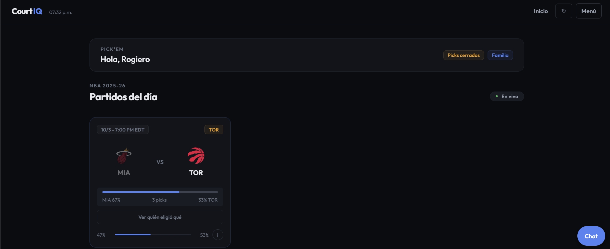
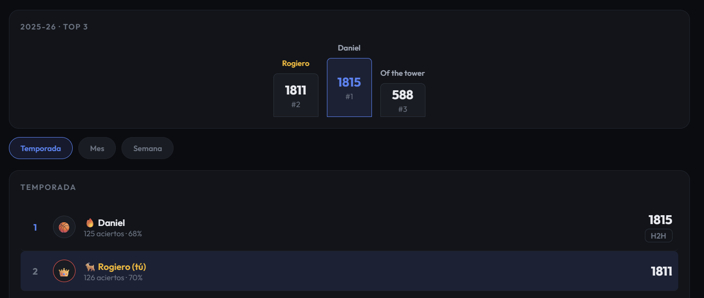
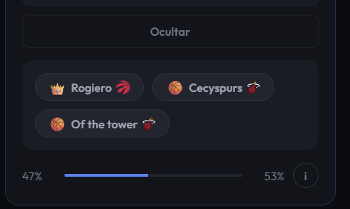

# Court IQ

An NBA pick'em web app where friends predict game winners, compete on a shared leaderboard, and wager in-app currency against each other. Live at **[court-iq-woad.vercel.app](https://court-iq-woad.vercel.app)** with ~12 active users across several private groups.

Built and maintained solo since 2025.

---

## Screenshots

<!-- Sustituye estas líneas por tus capturas reales.
     Súbelas a /docs/screenshots/ en el repo y ajusta las rutas. -->

| Daily picks | Group leaderboard | Head-to-head bets |
|---|---|---|
|  |  |  |

---

## What it does

**Pick'em** — Users predict the winner of each NBA game before tipoff. Points scale inversely to the favorite's win probability, so calling an upset is worth more than picking the obvious favorite. A confidence multiplier (1x–3x) lets users risk points on picks they're sure about.

**Private groups** — Users create or join groups with a 6-character invite code. Picks replicate automatically across every group the user belongs to, so nobody has to enter the same prediction three times.

**Coin betting** — Head-to-head wagers on individual games using in-app currency. Bets can be open to the group or targeted at a specific member. Settlement is automatic once the game ends.

**Playoff bracket** — Full postseason predictions including the play-in tournament, with bonus points for correct series scores and Finals MVP.

**Push notifications** — Game reminders, scoring summaries, and bet challenges via the Web Push API.

---

## Architecture

```
React SPA (Vite)
      │
      ├──► /api/pickem  ──► Supabase (PostgreSQL)
      │    serverless          RLS enabled,
      │    function            service-key access
      │
      └──► /api/scoreboard ──► ESPN public API
           /api/standings       (games, standings, rosters)
           /api/players
```

**Frontend** — React 18 with Vite. Application state lives in `App.jsx` and flows down through props; no global state library. Deployed as a PWA with offline shell caching via Workbox.

**Backend** — A single Vercel serverless function handles every write operation. This is deliberate: it keeps all validation, scoring, and currency logic in one place that the client can't reach.

**Data** — Supabase for persistence. ESPN's public API for live scores, standings, and rosters, with a 30-second in-memory cache to avoid hammering it during pick bursts.

### Why a single API endpoint

The app started with direct client-to-Supabase calls. That works until you need to enforce rules the client shouldn't be trusted with — *this game already started, you can't change your pick* — at which point the browser becomes an attacker with your database credentials.

Routing everything through one serverless function meant:

- Row Level Security could be enabled on every table, with the anon key locked out entirely
- Game-state validation happens server-side against ESPN before any pick or bet is written
- Rate limiting and account lockout live where they can't be bypassed

The tradeoff is a bigger function and a single point of failure. At this scale that's the right call.

---

## Notable engineering problems

### A silenced error that hid a bug for months

`loadStandings()` referenced an undefined `ROSTERS` variable inside a `try/catch` that swallowed everything:

```js
try {
  // ...
  players: ROSTERS[abbr]   // ReferenceError, silently caught
} catch (_) {}
```

The catch block meant the app fell back to hardcoded standings without any indication something was wrong. Users saw stale data for months. Every empty catch in the codebase has since been given either a `console.warn` or a proper failure path.

**Takeaway:** a `catch` that discards the error isn't error handling — it's error hiding.

### Timezone bug that broke every evening pick

Dates were computed with `new Date().toISOString().split("T")[0]`, which always returns UTC. In Monterrey (UTC-6) that means anything after 6 PM local time is recorded as tomorrow. Since NBA games tip off between 7 and 10 PM Central, **most picks were being saved under the wrong date**, corrupting daily rankings and pick history.

Fixed with a `getToday()` helper that builds the date from local components, plus explicit `date` parameters on the API calls that were computing it server-side.

### Client-side validation isn't validation

The bet acceptance endpoint checked whether a game had started — but wrapped the check in a `try/catch` that let the request through if ESPN timed out:

```js
} catch (_) {
  // Si ESPN falla, igual dejamos pasar (mejor experiencia)
}
```

That comment ("if ESPN fails, let it through anyway — better UX") is the bug. Any network hiccup opened a window to accept bets on games that had already finished. Now the endpoint fails closed: if the game state can't be verified, the request is rejected with a retry message.

### Brute-forceable 4-digit PIN

Authentication is a username and a 4-digit PIN — 10,000 combinations. The original rate limiter was per-IP, which an attacker bypasses by rotating IPs.

Replaced with per-account tracking in the database and exponential backoff: the 5th failed attempt locks the account for 5 minutes, the 6th for 10, doubling up to an hour. This turns a hours-long attack into a multi-year one.

---

## Refactor

The app was originally a single `App.jsx` file of ~4,000 lines. It was extracted into 18 modules:

```
src/
├── theme.js              Design tokens
├── App.jsx               Root, shared state, routing
├── api/pickem.js         API client
├── data/                 Static data (teams, shop items, trivia)
├── utils/
│   ├── scoring.js        Pure functions — win %, dynamic points
│   ├── cosmetics.js      Shop item resolution
│   ├── date.js           Local-timezone date helper
│   ├── season.js         NBA season calculation
│   └── push.js           Web Push subscription
└── components/           One file per tab, plus shared primitives
```

Splitting the file surfaced the `ROSTERS` bug within an hour — it had been invisible inside 4,000 lines of tightly coupled code.

---

## Design system

The UI was rebuilt around a token system in `theme.js`. Before: roughly 15 competing accent colors, three font families, and arbitrary spacing values. After: a single accent, semantic colors reserved for state (success/danger/warning), a 7-step type scale, and spacing on a 4px grid.

The practical rule was **one accent color, everything else earns its place**. Gold for coins, purple for minigames, and orange for streaks were all removed — they were decoration, not communication.

---

## Local development

The `/api` routes are Vercel serverless functions, so `npm run dev` alone won't work — Vite serves the frontend but the API returns 404.

```bash
npm install
vercel env pull .env.local   # requires Vercel CLI and project access
vercel dev                    # runs frontend + serverless functions
```

Required environment variables:

| Variable | Purpose |
|---|---|
| `SUPABASE_URL` | Project URL |
| `SUPABASE_SERVICE_KEY` | Server-side key — bypasses RLS |
| `SUPABASE_ANON_KEY` | Fallback for the service key |
| `VAPID_PUBLIC_KEY` / `VAPID_PRIVATE_KEY` | Web Push |
| `RESEND_API_KEY` | Password recovery emails |

---

## Stack

React · Vite · Node.js serverless (Vercel) · PostgreSQL (Supabase) · Recharts · Workbox · Web Push

---
## Testing

```bash
npm run test        # watch mode
npm run test:run    # single run
```

Unit tests cover the scoring module — win probability, dynamic point calculation, and the confidence multiplier — including edge cases like missing standings, division by zero on teams with no games played, and score clamping.
## Roadmap

- Unit tests for the pure scoring and cosmetics functions
- Full NBA roster search (currently limited to league scoring leaders)
- Live-data trivia so minigame content refreshes with the season
- Fantasy league mode

---

## Author

**Rogiero De La Torre Maldonado** — Computer Science & Technology Engineering, Tecnológico de Monterrey

[LinkedIn](https://linkedin.com/in/rogiero-de-la-torre-maldonado-41ab922b4) · [GitHub](https://github.com/Rogierotm29)